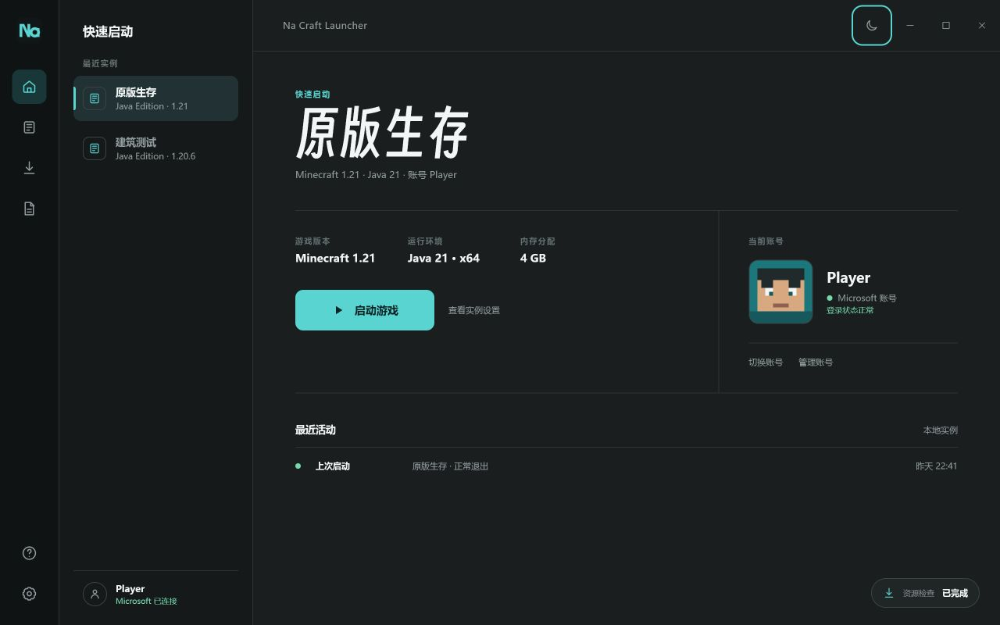

# Na Craft Launcher

NaCL 是一款面向 Windows 的极简 Minecraft: Java Edition 启动器。

NaCL is a minimalist Minecraft: Java Edition launcher for Windows, built with Tauri, Vue, TypeScript and Rust.

> [!IMPORTANT]
> **开发状态 / Development status: Pre-alpha**
>
> 当前仓库用于公开开发和技术预览。Microsoft 登录、离线档案与完整游戏启动流程尚未完成，也没有面向普通玩家发布的稳定安装包。
>
> This repository is for public development and technical preview. Microsoft sign-in, offline profiles, and the complete game launch flow are not finished. No stable end-user installer is available yet.



## 项目状态 / Project status

### 中文

- 原版 Minecraft 版本浏览、下载与实例安装
- 独立实例配置、复制、删除与本地目录管理
- Java 运行环境检测、手动选择与 Temurin 托管下载
- 物理内存检测与新实例内存分配
- 深色/浅色主题及低开销页面切换动画
- 本地日志、存储诊断和下载策略设置

账号与游戏启动功能仍在开发。Microsoft 登录尚未开放，需完成 Minecraft Java Edition Game Service API 审核；离线档案也尚未接入正式启动流程。

### English

- Browse official Minecraft versions, download version files, and create vanilla instances
- Configure, copy, delete, and open isolated instance directories
- Detect local Java installations, select Java manually, or download managed Eclipse Temurin runtimes
- Detect physical memory and configure per-instance memory allocation
- Switch between dark and light themes with lightweight page transitions
- Inspect local logs and storage diagnostics, and configure download behavior

Account management and the complete game launch flow are still under development. Microsoft sign-in is pending access to the Minecraft Java Edition Game Service API, and offline profiles are not yet connected to the final launch flow.

See the bilingual [Privacy Notice / 隐私说明](PRIVACY.md) for local data, network requests, and the planned Microsoft authentication flow.

## 技术栈

- [Tauri 2](https://tauri.app/)
- [Vue 3](https://vuejs.org/)
- TypeScript
- Rust

项目源码位于 [`app/`](app/)，设计过程与界面渲染位于 [`design/`](design/)。

## Windows 开发环境

需要准备：

- Node.js 20 或更高版本
- Rust stable 与 MSVC 工具链
- Windows 10/11
- Microsoft Edge WebView2 Runtime

```powershell
cd app
npm.cmd install
npm.cmd run tauri dev
```

构建调试版：

```powershell
cd app
npm.cmd run tauri build -- --debug --no-bundle
```

前端检查：

```powershell
cd app
npm.cmd run build
```

Rust 测试：

```powershell
cd app
cargo test --workspace
```

## 本地数据

用户设置和实例配置保存在 `%APPDATA%\NaCL`，可重新下载的数据、Java 运行环境和日志保存在 `%LOCALAPPDATA%\NaCL`。构建产物不会提交到仓库。

未来的 Microsoft 登录不会在 NaCL 内收集密码；短期访问令牌只用于用户主动发起的 Minecraft 验证和启动流程，刷新令牌计划使用 Windows 用户级加密保护。完整说明见 [`PRIVACY.md`](PRIVACY.md)。

## 字体

界面标题使用 [得意黑 Smiley Sans](https://github.com/atelier-anchor/smiley-sans)。字体由 atelierAnchor 发布，采用 SIL Open Font License 1.1；随项目分发的字体文件及完整许可见 [`app/src/assets/fonts/OFL.txt`](app/src/assets/fonts/OFL.txt)。

## 声明

NaCL 是独立社区项目，不隶属于 Mojang Studios、Microsoft 或 Xbox。Minecraft 名称和相关资产归各自权利人所有。

项目代码当前未单独授予开源许可证；仓库内的第三方字体继续遵循其自身许可证。
